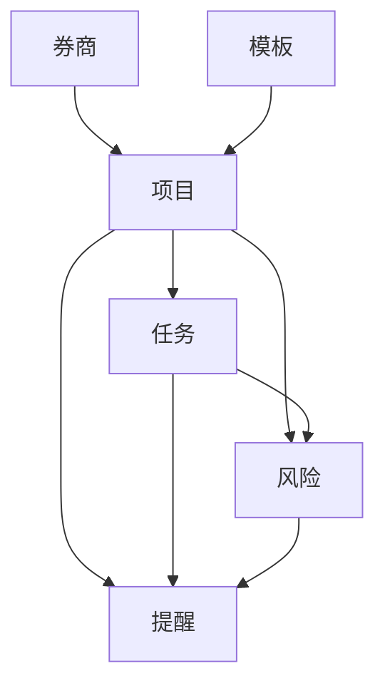
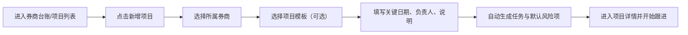

# 项目管理平台 PRD

## 1. 文档信息

- 文档名称：项目管理平台 PRD
- 文档版本：V1.0
- 编写日期：2026-04-13
- 使用对象：项目管理者、产品、开发、测试
- 当前阶段：需求确认稿 / 可进入原型与开发设计

## 2. 产品概述

### 2.1 产品背景

当前需要统一管理 20 家券商的多个项目事项，项目推进过程中涉及任务拆分、负责人安排、关键交付时间、风险跟进和阶段汇报。现阶段如果依赖零散记录，容易出现以下问题：

- 无法快速掌握每家券商当前有哪些项目正在推进
- 任务计划时间、实际执行和完成情况不集中，容易遗漏
- 风险点分散，关键节点是否受影响难以及时判断
- 每周汇报需要手工整理，重复劳动较多
- 新项目接入时缺少标准化模板，无法快速复制成熟流程

### 2.2 产品目标

本平台第一阶段定位为项目管理者个人使用的桌面端管理工具，核心目标如下：

1. 统一管理券商、项目、任务、风险和提醒
2. 随时查看项目整体进度、临期任务、逾期事项和高风险问题
3. 形成可复用的项目模板，提高新项目接入效率
4. 自动生成基础周报，减少重复整理成本

### 2.3 核心价值

- 管理视角清晰：从券商到项目到任务逐层可见
- 日常跟进高效：优先处理临期、逾期和高风险事项
- 沉淀标准方法：项目模板可复制复用
- 汇报输出稳定：周报自动汇总，口径统一

## 3. 用户与使用场景

### 3.1 核心用户

- 项目管理者本人

### 3.2 典型使用场景

1. 每天打开首页，先看临期、逾期和高风险事项
2. 新增某家券商的项目，例如版本升级、接口改造、常规对接
3. 在项目下维护交付任务，例如后台程序包、接口包、条件单包
4. 记录任务负责人、计划时间、实际执行和完成情况
5. 登记项目风险，跟踪责任人、影响和解决动作
6. 周末或固定时间导出周报，用于内部汇报或自我复盘
7. 将成熟项目沉淀成模板，供后续项目快速复用

## 4. 产品范围

### 4.1 本期范围

- 券商管理
- 项目管理
- 任务管理
- 风险管理
- 跟进记录
- 提醒中心
- 模板中心
- 周报导出

### 4.2 本期暂不包含

- 多角色权限体系
- 外部消息渠道接入（邮件、企业微信、钉钉）
- Excel 批量导入
- 附件上传和版本留痕
- 移动端深度适配
- 复杂图表分析和审批流

## 5. 信息架构

### 5.1 业务层级

平台统一采用以下结构：

`券商 -> 项目 -> 任务 -> 风险 / 提醒`

说明：

- 券商：管理对象主体，例如 A 券商、B 券商
- 项目：券商下的具体事项，例如 4 月 20 日版本升级、接口改造
- 任务：项目下的具体交付项，例如后台程序包、接口包、条件单包
- 风险：项目或任务推进中的问题与不确定性
- 提醒：围绕临期、逾期、高风险和关键节点生成的待处理信息

### 5.2 信息架构图



## 6. 业务示例

### 6.1 典型项目示例

- 券商：A 券商
- 项目：2026-04-20 版本升级
- 关键交付项：
  - 后台程序包
  - 接口包
  - 条件单包
- 每个任务需要记录：
  - 负责人
  - 计划提供时间
  - 实际执行
  - 完成情况
- 项目中需要记录风险点：
  - 风险 1：示例风险描述
  - 风险 2：示例风险描述

### 6.2 适用项目类型

- 版本升级
- 接口改造
- 常规对接
- 新项目接入
- 资料准备与验证类事项

## 7. 业务流程

### 7.1 新建项目流程



### 7.2 日常跟进流程


### 7.3 模板复用流程


## 8. 页面结构与导航

建议采用顶部导航或左侧导航，主菜单如下：

1. 首页驾驶舱
2. 券商台账
3. 项目列表
4. 风险与提醒中心
5. 模板中心
6. 周报导出

## 9. 页面原型说明

### 9.1 首页驾驶舱

目标：帮助用户每天快速识别应该优先处理的事项。

页面结构：

```text
┌──────────────────────────────────────────────────────────────────────┐
│ 项目管理平台                                          [搜索] [新增项目] │
├──────────────────────────────────────────────────────────────────────┤
│ 首页驾驶舱 | 券商台账 | 项目列表 | 风险提醒 | 模板中心 | 周报导出       │
├──────────────────────────────────────────────────────────────────────┤
│ [总券商数 20] [进行中项目 16] [临期任务 8] [逾期任务 3] [高风险 5]      │
├──────────────────────────────────────────────────────────────────────┤
│ 即将到期升级/上线                                                     │
│ A券商 | 4/20版本升级 | 执行中 | 还有7天 | 负责人：张三                 │
│ B券商 | 接口改造    | 准备中 | 还有2天 | 负责人：李四                 │
├──────────────────────────────────────────────────────────────────────┤
│ 风险预警 TOP5                    │ 今日待关注                        │
│ 1. A券商-接口包延迟              │ 1. 3天内到期未完成任务            │
│ 2. C券商-条件单验证未完成        │ 2. 已逾期任务                    │
│ 3. D券商-对方反馈未确认          │ 3. 高风险未关闭事项              │
├──────────────────────────────────────────────────────────────────────┤
│ 项目进度总览                                                         │
│ A券商 | 4月20日升级 | 75% | 执行中 | 风险2 | 任务 5/8完成             │
└──────────────────────────────────────────────────────────────────────┘
```

核心能力：

- 统计卡片展示整体状态
- 展示即将到期项目
- 展示高风险事项和今日待处理事项
- 展示项目进度总览表

### 9.2 券商台账页

目标：按券商查看当前所有项目、风险和关键节点。

```text
┌──────────────────────────────────────────────────────────────────────┐
│ 券商台账                                  [新增券商] [筛选状态/负责人] │
├──────────────────────────────────────────────────────────────────────┤
│ 券商名称 | 当前项目数 | 最近关键节点 | 进行中 | 逾期 | 风险 | 操作      │
├──────────────────────────────────────────────────────────────────────┤
│ A券商   | 3          | 4/20版本升级 | 2      | 1    | 2    | 查看详情   │
│ B券商   | 2          | 4/18接口改造 | 1      | 0    | 1    | 查看详情   │
└──────────────────────────────────────────────────────────────────────┘
```

券商详情页建议包含以下 Tab：

- 基本信息
- 项目列表
- 风险汇总
- 历史记录

### 9.3 项目列表页

目标：从项目视角批量查看进度、负责人、风险与逾期情况。

```text
┌──────────────────────────────────────────────────────────────────────┐
│ 项目列表                                                [新增项目]     │
├──────────────────────────────────────────────────────────────────────┤
│ 筛选： [券商] [项目类型] [状态] [负责人] [关键日期范围] [是否逾期]     │
├──────────────────────────────────────────────────────────────────────┤
│ 项目 | 券商 | 类型 | 负责人 | 计划日期 | 任务完成率 | 风险 | 状态      │
│ 4月20日升级 | A券商 | 升级 | 张三 | 4/20 | 5/8 | 2 | 执行中          │
│ 接口改造    | B券商 | 改造 | 李四 | 4/18 | 2/6 | 1 | 准备中          │
└──────────────────────────────────────────────────────────────────────┘
```

### 9.4 项目详情页

目标：完成项目日常管理、任务跟进和风险处理。

```text
┌──────────────────────────────────────────────────────────────────────┐
│ A券商 > 2026-04-20 版本升级                 [编辑项目] [复制为模板]     │
├──────────────────────────────────────────────────────────────────────┤
│ 项目概况                                                             │
│ 项目状态：执行中   整体进度：75%   项目负责人：张三   关键日期：4/20    │
│ 项目说明：本次涉及后台程序包、接口包、条件单包升级                    │
├──────────────────────────────────────────────────────────────────────┤
│ 任务清单                                               [新增任务]       │
│ 任务名称     | 负责人 | 计划内容 | 计划时间 | 实际执行 | 完成情况 | 状态 │
│ 后台程序包   | 张三   | 提供程序包 | 4/15   | 已提交   | 完成     | 已完成│
│ 接口包       | 李四   | 提供接口包 | 4/16   | 联调中   | 进行中   | 进行中│
│ 条件单包     | 王五   | 提供条件单 | 4/14   | 未提交   | 未完成   | 逾期  │
├──────────────────────────────────────────────────────────────────────┤
│ 风险清单                                               [新增风险]       │
│ 风险标题       | 等级 | 影响关键节点 | 责任人 | 计划关闭时间 | 状态      │
│ 接口验证延迟   | 高   | 是           | 李四   | 4/17         | 处理中    │
├──────────────────────────────────────────────────────────────────────┤
│ 提醒记录                                                             │
│ 4/13 条件单包已逾期1天                                                │
│ 4/13 接口包距离计划时间还有3天                                        │
└──────────────────────────────────────────────────────────────────────┘
```

### 9.5 风险与提醒中心

目标：集中处理临期、逾期和高风险问题。

```text
┌──────────────────────────────────────────────────────────────────────┐
│ 风险与提醒中心                                [筛选：高风险/逾期/临期]  │
├──────────────────────────────────────────────────────────────────────┤
│ Tab: 全部提醒 | 临期任务 | 逾期任务 | 高风险 | 关键节点受影响            │
├──────────────────────────────────────────────────────────────────────┤
│ 类型   | 券商 | 项目           | 事项         | 等级 | 截止时间 | 状态     │
│ 逾期   | A券商| 4月20日升级    | 条件单包     | 高   | 4/14     | 未完成   │
│ 临期   | B券商| 接口改造       | 接口验证     | 中   | 4/15     | 进行中   │
└──────────────────────────────────────────────────────────────────────┘
```

### 9.6 模板中心

目标：沉淀标准项目结构，用于快速创建新项目。

```text
┌──────────────────────────────────────────────────────────────────────┐
│ 模板中心                                           [新建模板]           │
├──────────────────────────────────────────────────────────────────────┤
│ 模板名称       | 适用场景     | 标准任务数 | 默认风险项 | 最近使用 | 操作   │
│ 版本升级模板   | 升级/上线     | 8          | 4          | 10次     | 使用   │
│ 接口改造模板   | 联调/改造     | 6          | 3          | 5次      | 使用   │
└──────────────────────────────────────────────────────────────────────┘
```

### 9.7 周报导出页

目标：自动汇总本周进展，减少重复整理工作。

```text
┌──────────────────────────────────────────────────────────────────────┐
│ 周报导出                                [选择周期] [生成周报] [复制文本] │
├──────────────────────────────────────────────────────────────────────┤
│ 本周完成事项                                                         │
│ 下周计划事项                                                         │
│ 逾期事项                                                             │
│ 重点风险                                                             │
│ 需协调事项                                                           │
└──────────────────────────────────────────────────────────────────────┘
```

## 10. 功能需求明细

### 10.1 券商管理

功能说明：

- 新增券商
- 编辑券商基础信息
- 查看券商详情
- 从券商视角查看项目、风险和历史记录

基础字段：

- 券商名称
- 券商简称
- 对接人
- 联系方式
- 状态
- 备注

### 10.2 项目管理

功能说明：

- 新增项目
- 编辑项目
- 查看项目列表
- 从模板创建项目
- 复制已有项目
- 归档项目

项目字段：

- 项目名称
- 所属券商
- 项目类型
- 项目负责人
- 关键计划日期
- 实际完成日期
- 项目状态
- 进度百分比
- 优先级
- 是否关键项目
- 项目说明

### 10.3 任务管理

功能说明：

- 在项目下新增多个任务
- 维护计划时间、负责人和计划内容
- 更新实际执行和完成情况
- 自动识别逾期
- 支持任务排序

任务字段：

- 任务名称
- 任务类型
- 负责人
- 协同人
- 计划内容
- 计划时间
- 实际执行
- 实际完成时间
- 完成情况
- 当前状态
- 优先级
- 是否逾期
- 备注

### 10.4 风险管理

功能说明：

- 在项目或任务下新增风险
- 标记风险等级和责任人
- 记录影响说明和应对措施
- 标记是否影响关键节点
- 跟踪风险状态变化

风险字段：

- 风险标题
- 所属项目
- 关联任务
- 风险等级
- 风险描述
- 影响说明
- 应对措施
- 责任人
- 计划解决时间
- 实际解决时间
- 当前状态
- 是否影响关键节点
- 备注

### 10.5 跟进记录

功能说明：

- 为项目或任务添加跟进内容
- 记录跟进时间、结论和下一步动作
- 支持按时间倒序展示

### 10.6 提醒中心

功能说明：

- 展示临期任务
- 展示逾期任务
- 展示高风险问题
- 展示关键节点受影响事项
- 支持标记已处理

### 10.7 模板中心

功能说明：

- 新建模板
- 编辑模板
- 基于模板创建项目
- 从现有项目沉淀为模板

模板内容建议包含：

- 标准任务清单
- 默认负责人角色
- 默认提醒规则
- 默认风险检查项

### 10.8 周报导出

默认生成以下 5 个模块：

1. 本周完成事项
2. 下周计划事项
3. 逾期事项
4. 重点风险
5. 需协调事项

## 11. 页面按钮交互说明

### 11.1 首页驾驶舱

- `新增项目`：打开新增项目弹窗
- 统计卡片：点击后跳转到对应筛选结果列表
- 即将到期项目：点击后进入项目详情
- 今日待关注：点击后进入提醒中心对应记录

### 11.2 券商台账页

- `新增券商`：打开新增券商弹窗
- `查看详情`：进入券商详情页
- `新增项目`：带入当前券商信息创建项目
- 筛选项：按状态、负责人、风险、是否逾期过滤列表

### 11.3 项目列表页

- `新增项目`：创建项目，可选择模板
- `查看详情`：进入项目详情页
- `复制项目`：复制结构和任务清单，不复制执行记录
- `生成周报`：为单个项目生成周报摘要
- `标记完成`：校验未完成任务后确认项目完结

### 11.4 项目详情页

- `编辑项目`：编辑基础信息
- `复制为模板`：将当前项目沉淀为模板
- `新增任务`：新增项目任务
- `新增风险`：新增风险记录
- `新增记录`：新增跟进记录
- 任务状态编辑：刷新进度与提醒
- 风险状态编辑：关闭或更新对应提醒

### 11.5 风险与提醒中心

- Tab 切换：按提醒类型筛选
- `去处理`：进入对应项目或打开处理抽屉
- `标记已处理`：修改提醒状态并记录处理时间
- `调整计划时间`：修改时间后重新计算提醒

### 11.6 模板中心

- `新建模板`：创建空白模板
- `使用模板`：基于模板创建项目
- `编辑模板`：修改模板内容
- `停用模板`：保留模板但不允许继续新建项目时使用

### 11.7 周报导出页

- `选择周期`：切换统计周范围
- `生成周报`：自动汇总周报内容
- `复制文本`：复制可直接汇报的文本
- `保存草稿`：保存当前编辑版本

## 12. 数据库设计

### 12.1 核心表结构

建议第一版包含以下 10 张表：

1. brokers
2. members
3. projects
4. tasks
5. risks
6. project_logs
7. templates
8. template_tasks
9. template_risks
10. reminders

所有表统一包含以下基础字段：

- id
- created_at
- updated_at
- is_deleted

### 12.2 brokers 券商表

| 字段 | 类型 | 必填 | 说明 |
| --- | --- | --- | --- |
| id | bigint | 是 | 主键 |
| name | varchar(100) | 是 | 券商全称 |
| short_name | varchar(50) | 是 | 券商简称 |
| contact_name | varchar(50) | 否 | 对接人 |
| contact_phone | varchar(30) | 否 | 联系方式 |
| status | varchar(20) | 是 | active / inactive |
| note | text | 否 | 备注 |

### 12.3 members 人员表

| 字段 | 类型 | 必填 | 说明 |
| --- | --- | --- | --- |
| id | bigint | 是 | 主键 |
| name | varchar(50) | 是 | 姓名 |
| role | varchar(50) | 否 | 角色 |
| mobile | varchar(30) | 否 | 手机 |
| email | varchar(100) | 否 | 邮箱 |
| status | varchar(20) | 是 | active / inactive |
| note | text | 否 | 备注 |

### 12.4 projects 项目表

| 字段 | 类型 | 必填 | 说明 |
| --- | --- | --- | --- |
| id | bigint | 是 | 主键 |
| broker_id | bigint | 是 | 所属券商 |
| template_id | bigint | 否 | 来源模板 |
| name | varchar(100) | 是 | 项目名称 |
| project_type | varchar(50) | 是 | 项目类型 |
| owner_id | bigint | 是 | 项目负责人 |
| planned_date | date | 是 | 关键计划日期 |
| actual_finish_date | date | 否 | 实际完成日期 |
| status | varchar(20) | 是 | 项目状态 |
| progress_percent | int | 是 | 0-100 |
| priority | varchar(20) | 否 | 高 / 中 / 低 |
| is_key_project | tinyint | 是 | 是否关键项目 |
| description | text | 否 | 项目说明 |
| last_follow_up_at | datetime | 否 | 最近跟进时间 |

### 12.5 tasks 任务表

| 字段 | 类型 | 必填 | 说明 |
| --- | --- | --- | --- |
| id | bigint | 是 | 主键 |
| project_id | bigint | 是 | 所属项目 |
| name | varchar(100) | 是 | 任务名称 |
| task_type | varchar(50) | 否 | 任务类型 |
| owner_id | bigint | 是 | 负责人 |
| collaborator_text | varchar(200) | 否 | 协同人 |
| planned_content | text | 是 | 计划内容 |
| planned_date | date | 是 | 计划时间 |
| actual_action | text | 否 | 实际执行 |
| actual_finish_date | date | 否 | 实际完成时间 |
| completion_result | text | 否 | 完成情况 |
| status | varchar(20) | 是 | 任务状态 |
| priority | varchar(20) | 是 | 高 / 中 / 低 |
| is_overdue | tinyint | 是 | 是否逾期 |
| sort_no | int | 否 | 排序 |
| remark | text | 否 | 备注 |

### 12.6 risks 风险表

| 字段 | 类型 | 必填 | 说明 |
| --- | --- | --- | --- |
| id | bigint | 是 | 主键 |
| project_id | bigint | 是 | 所属项目 |
| task_id | bigint | 否 | 关联任务 |
| title | varchar(100) | 是 | 风险标题 |
| level | varchar(20) | 是 | 高 / 中 / 低 |
| description | text | 是 | 风险描述 |
| impact_desc | text | 否 | 影响说明 |
| action_plan | text | 是 | 应对措施 |
| owner_id | bigint | 是 | 责任人 |
| planned_resolve_date | date | 否 | 计划解决时间 |
| actual_resolve_date | date | 否 | 实际解决时间 |
| status | varchar(20) | 是 | 风险状态 |
| affects_milestone | tinyint | 是 | 是否影响关键节点 |
| remark | text | 否 | 备注 |

### 12.7 project_logs 跟进记录表

| 字段 | 类型 | 必填 | 说明 |
| --- | --- | --- | --- |
| id | bigint | 是 | 主键 |
| project_id | bigint | 是 | 所属项目 |
| task_id | bigint | 否 | 关联任务 |
| log_date | datetime | 是 | 跟进时间 |
| log_type | varchar(30) | 是 | 跟进类型 |
| content | text | 是 | 跟进内容 |
| next_action | text | 否 | 下一步动作 |
| created_by | bigint | 否 | 记录人 |

### 12.8 templates 模板表

| 字段 | 类型 | 必填 | 说明 |
| --- | --- | --- | --- |
| id | bigint | 是 | 主键 |
| name | varchar(100) | 是 | 模板名称 |
| template_type | varchar(50) | 是 | 模板类型 |
| applicable_scene | varchar(100) | 否 | 适用场景 |
| description | text | 否 | 模板说明 |
| default_reminder_rule | text | 否 | 默认提醒规则 |
| status | varchar(20) | 是 | 启用 / 停用 |

### 12.9 template_tasks 模板任务表

| 字段 | 类型 | 必填 | 说明 |
| --- | --- | --- | --- |
| id | bigint | 是 | 主键 |
| template_id | bigint | 是 | 所属模板 |
| name | varchar(100) | 是 | 标准任务名 |
| task_type | varchar(50) | 否 | 任务类型 |
| default_owner_role | varchar(50) | 否 | 默认负责人角色 |
| default_offset_days | int | 否 | 相对关键日期偏移天数 |
| default_priority | varchar(20) | 是 | 高 / 中 / 低 |
| planned_content | text | 否 | 默认计划内容 |
| sort_no | int | 否 | 排序 |

### 12.10 template_risks 模板风险表

| 字段 | 类型 | 必填 | 说明 |
| --- | --- | --- | --- |
| id | bigint | 是 | 主键 |
| template_id | bigint | 是 | 所属模板 |
| title | varchar(100) | 是 | 默认风险标题 |
| level | varchar(20) | 是 | 高 / 中 / 低 |
| description | text | 否 | 默认风险描述 |
| impact_desc | text | 否 | 默认影响 |
| action_plan | text | 否 | 默认应对措施 |
| default_offset_days | int | 否 | 默认关注时间点 |
| affects_milestone | tinyint | 是 | 是否影响关键节点 |
| sort_no | int | 否 | 排序 |

### 12.11 reminders 提醒表

| 字段 | 类型 | 必填 | 说明 |
| --- | --- | --- | --- |
| id | bigint | 是 | 主键 |
| project_id | bigint | 是 | 所属项目 |
| task_id | bigint | 否 | 关联任务 |
| risk_id | bigint | 否 | 关联风险 |
| reminder_type | varchar(30) | 是 | 临期 / 逾期 / 高风险 / 关键节点 |
| reminder_time | datetime | 是 | 提醒时间 |
| content | text | 是 | 提醒内容 |
| status | varchar(20) | 是 | 待处理 / 已处理 / 忽略 |
| handled_at | datetime | 否 | 处理时间 |
| handled_note | text | 否 | 处理说明 |

## 13. 业务规则

### 13.1 项目状态

- 规划中
- 准备中
- 执行中
- 待收尾
- 已完成
- 已延期
- 已暂停

### 13.2 任务状态

- 未开始
- 进行中
- 待对方反馈
- 已完成
- 已逾期
- 已暂停

### 13.3 风险状态

- 待处理
- 处理中
- 已解除
- 持续关注

### 13.4 提醒类型

- 临期提醒
- 逾期提醒
- 高风险提醒
- 关键节点提醒

### 13.5 自动规则

1. 项目进度默认按任务完成率自动计算  
   公式：`已完成任务数 / 总任务数 * 100`

2. 任务逾期规则  
   当 `planned_date < 当前日期` 且任务状态不是已完成时，任务自动标记为逾期

3. 临期提醒规则  
   距计划日期 3 天内且任务未完成时，生成临期提醒

4. 高风险规则  
   风险等级为高，或影响关键节点时，在首页和提醒中心高亮

5. 项目完成规则  
   当项目下所有任务均完成后，系统可提示用户将项目标记为已完成

6. 模板生成规则  
   模板只复制项目结构、标准任务和风险项，不复制实际执行记录

## 14. 关键表单设计

### 14.1 新增项目

- 所属券商
- 项目名称
- 项目类型
- 关键计划日期
- 项目负责人
- 优先级
- 是否关键项目
- 项目说明
- 是否从模板创建

### 14.2 新增任务

- 任务名称
- 任务类型
- 负责人
- 协同人
- 计划内容
- 计划时间
- 优先级
- 备注

### 14.3 新增风险

- 风险标题
- 关联任务
- 风险等级
- 风险描述
- 影响说明
- 应对措施
- 责任人
- 计划解决时间
- 是否影响关键节点
- 备注

### 14.4 新增跟进记录

- 跟进时间
- 跟进类型
- 跟进内容
- 下一步动作

## 15. MVP 功能优先级

### 15.1 P0 必做

- 券商管理
- 项目管理
- 任务管理
- 风险管理
- 跟进记录
- 首页驾驶舱
- 风险与提醒中心
- 项目详情页
- 模板中心基础能力
- 周报导出基础能力

### 15.2 P1 建议第二阶段补充

- 项目复制
- 从现有项目生成模板
- 归档管理
- 更多筛选与搜索
- 导出列表
- 自定义提醒规则

### 15.3 P2 后续增强

- 附件上传
- 外部提醒接入
- 多人协同
- Excel 批量导入
- 可视化图表报表

## 16. 验收标准

第一版上线需满足以下条件：

1. 能创建券商，并在券商下创建多个项目
2. 能在项目下维护任务，记录计划时间、实际执行和完成状态
3. 能登记风险，并维护风险等级、责任人、解决计划和状态
4. 能自动识别临期任务、逾期任务和高风险事项
5. 首页能展示整体概览和今日优先处理事项
6. 能通过模板快速创建项目
7. 能生成基础周报内容

## 17. 后续建议

建议后续推进顺序如下：

1. 根据本 PRD 输出高保真页面原型
2. 基于字段设计输出数据库建表脚本
3. 确定前后端技术方案并开始开发
4. 在系统内补充初始模板，如版本升级模板、接口改造模板、常规对接模板
